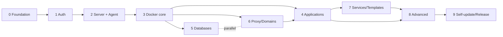

# Gotham Roadmap — Coolify clone (PaaS Platform)

Overall plan for building Gotham, a self-hosted PaaS (Coolify clone) using the tech stack in `README.md`:
**Go + Chi + sqlc/pgx + PostgreSQL + gRPC agent + Redis + Traefik + Vue 3 + Naive UI**.

---

## 1. Phase overview

| Phase | File | Contents | Milestone (exit criteria) | Week* |
|---|---|---|---|---|
| 0 | [01-foundation.md](01-foundation.md) | Repo skeleton, config, store, web | Binaries start, `/healthz` returns 200, migrations run, SPA embedded, CI green | W1 |
| 1 | [02-auth-users.md](02-auth-users.md) | Auth JWT + GitHub OAuth + API tokens | Sign up / sign in via UI, refresh token works | W2 |
| 2 | [03-server-agent.md](03-server-agent.md) | gRPC contract, agent, server registry | Add server via wizard, agent heartbeat shown in UI | W3–W4 |
| 3 | [04-docker-core.md](04-docker-core.md) | Docker engine core + realtime logs | List/start/stop containers, realtime logs via WebSocket | W5 |
| 4 | [05-applications.md](05-applications.md) | Deploy from Git (providers, builds, orchestration) | Deploy app from public GitHub repo, auto-deploy via webhook | W6–W8 |
| 5 | [06-databases-backups.md](06-databases-backups.md) | Managed databases + backups | Create DB, S3 backup, restore | W8–W9 |
| 6 | [07-proxy-domains.md](07-proxy-domains.md) | Traefik, domains, SSL | Custom domain + automatic Let's Encrypt HTTPS | W8–W9 |
| 7 | [08-services-templates.md](08-services-templates.md) | Compose services + template gallery | 1-click WordPress deploy from gallery | W10 |
| 8 | [09-advanced.md](09-advanced.md) | Previews, teams, notifications, metrics | Full core Coolify feature set | W11–W12 |
| 9 | [10-self-update-release.md](10-self-update-release.md) | Self-update + release pipeline | Signed `update` (Ed25519), releases on GitHub Releases | W13 |

\* Relative week (dev-week) from the start, assuming 1 coordinator + 3–4 subagents running in parallel in an orca workspace.
With more agents, weeks can shrink; there is no hard deadline.

## 2. Dependency graph

- **P5 ↔ P6** run in parallel (same P3 base, no shared files).
- **P4** uses direct ports to meet its exit criteria; official domain attachment lands in P6 (P6 must finish before P4's domain part is complete, but P4 can develop in parallel with P6 after P3).
- P8 only needs P4 + P7; it can start early on parts (teams, notifications) when idle.

## 3. Shared conventions (apply to every phase)

### Naming (Gotham)

- Product name is **Gotham**. Control-plane binary/CLI is `gotham` (`cmd/gotham/`), node agent binary is `gotham-agent` (`cmd/gotham-agent/`, impl in `agent/`).
- Env prefix `GOTHAM_`, config file `gotham.yaml`, container/volume prefix `gotham-`, built-app image tags `gotham/{appID}:{deployID}`.
- See **Naming conventions** in `README.md`.

### Work packages & orca workspace
- Each task in a phase file = 1 work package for 1 subagent, running in its **own orca workspace**: `ws/p<phase>-<slug>` (e.g. `ws/p4-builds`).
- Each workspace merges to the main branch via its **own PR**; CI must be green before merge.
- Tasks may run in parallel only when they touch no common files and depend on no each other's output (noted in each phase file).

### Model policy
- Code review: `openrouter/z-ai/glm-5.3-prime` — contract design (proto, service interfaces, orchestration state machine, template engine) and all review gates (G0/G1/G2).
- Implementation (coding): `deepseek v4.1 flash` / `Muse Spark 1.3 Contributor` / `MiMo-V2.6-Flash (go)` — implementation following agreed patterns. Task fit: Go/backend work (`internal/`, `agent/`, `proto/`, e2e scripts) → `MiMo-V2.6-Flash (go)`; spec-driven contract/API implementation → `deepseek v4.1 flash`; Vue/layout/composable/copy UI work (`web/`) → `Muse Spark 1.3 Contributor`. Subagent model IDs (exact): `opencode-go/mimo-v2.6-pro` (Go/backend — NOT the free variant), `opencode-go/deepseek-v4.1-flash`, `opencode-go/muse-spark-1.3-contributor`.
- ⭐ = tasks requiring the strongest review model for design; unmarked tasks use the coding models.

### Phase gate (continuous mode — owner waiver from Phase 3 onward)
- The owner waived per-phase STOPs: after a phase meets its exit criteria, the coordinator continues to the next phase automatically without asking. STOP only when blocked, when a decision is needed, or when a review gate fails.
- Milestone reports are posted as PR descriptions and chat summaries instead of gate approvals.

### Invariant (run after every task, before PR merge)
1. `go build ./...` passes.
2. `go test ./...` green (all existing tests must pass).
3. `golangci-lint run` clean; `go vet` clean.
4. Migrations are **forward-only** — never edit a merged migration; schema changes = new migration.
5. FE: `npm run build` passes, `npm run type-check` clean.
6. No cross-scope imports: `agent/` must not import `internal/`; domain packages must not import the HTTP server.

### Review gates (mandatory, block merge)
| Gate | When | Reviewers |
|---|---|---|
| G0 | End of Phase 0 | subagent `code-reviewer` (whole foundation), review model `openrouter/z-ai/glm-5.3-prime` |
| G1 | End of Phase 4 | `code-reviewer` + `e2e-runner` (core deploy experience), review model `openrouter/z-ai/glm-5.3-prime` |
| G2 | End of Phase 9 | `code-reviewer` + `security-reviewer` (release/self-update, signatures, install), review model `openrouter/z-ai/glm-5.3-prime` |

### Rollback
- Each phase file states how to roll back (revert migration, feature flag, old image tag) in its own section.
- General rule: every new feature after Phase 0 must be disable-able via an env flag if it touches the running deploy flow.

### Minimum dev environment
- Docker (to test agent + docker core), PostgreSQL 16, Redis 7 (dev containers in `deploy/compose.dev.yml` — created in Phase 0).
- Node 20+ (for `web/` only).
