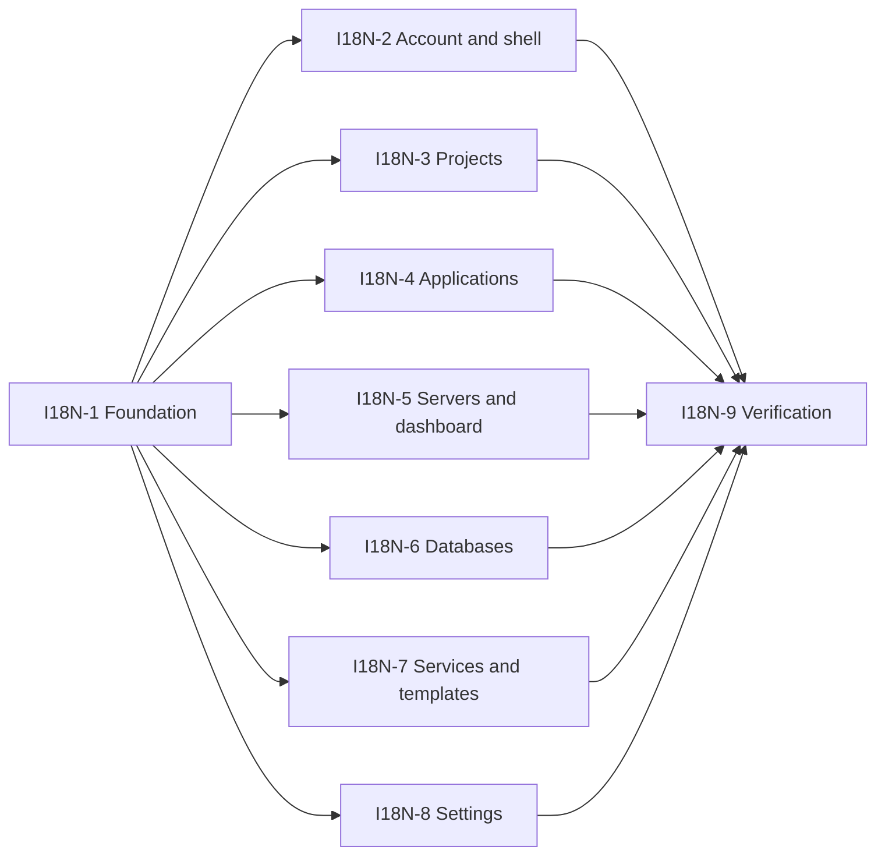

# English and Vietnamese UI localization

Planning baseline: 2026-10-06, `main` at `c27bba752915ab82293c78db143126364381cec6`.
Delivery status belongs in [`../TODO.md`](../TODO.md). This document describes proposed work;
creating tickets and an Orca task DAG does not authorize or start implementation workers.
Execution started 2026-10-06: I18N-1 ([JUS-42](../TODO.md)) is being implemented in
`ws/p14-i18n-foundation`; the remaining packages stay planned until dispatched.

## 1. Goal and scope

Provide English (`en`) and Vietnamese (`vi`) throughout the currently implemented SPA. A user
can switch language before or after signing in without reloading, losing a form draft, changing
the current route, or changing permissions. English remains the default and fallback.

Include navigation, page and tab headings, form labels, hints, placeholders, validation,
empty/loading/disabled states, dialogs, notifications shown inside the SPA, status labels,
accessibility text, chart labels, dates, counts, and user-facing error summaries. Translate
existing stub descriptions, but do not implement their missing functionality.

Keep user-owned names/descriptions, environment-variable keys and values, domains, URLs, paths,
commands, YAML, connection strings, logs, provider/engine/product names, wire enums, IDs,
versions, and server diagnostics intact. System-generated resource names such as `production`
remain actual resource names, not translated presentation identifiers.

Out of scope: language-specific routes, backend/agent/CLI/log translation, outbound email or
Slack/Discord/Telegram notification templates, a translation service, machine translation at
runtime, additional languages, server-side preferences, and speculative pages. No schema
migration, new API, or `Accept-Language` negotiation is needed for this scope.

The owner explicitly requested Vietnamese UI. During I18N-1, update the conflicting UI-copy
and multilingual-file language rules in `AGENTS.md` narrowly: translated message values may be
Vietnamese; code identifiers, keys, comments, commits, docs, and project replies stay English.
Mockups remain the visual reference; shipped English copy is the English catalog baseline.
Do not revive obsolete sample copy from a mockup (version tags, credentials, install snippets).

## 2. Verified starting point

- `web/package.json`: Vue 3, Pinia, Naive UI, zod, Vitest and Playwright are installed;
  Vue I18n is not. `web/src` currently contains 275 files, not 275 translatable screens.
- `app/main.ts` installs Pinia and the router and waits for initial navigation before mount.
  Its stale-chunk fallback creates English DOM text outside Vue. Preserve its one-reload guard.
- `app/App.vue` has one `NConfigProvider`, with theme overrides and no locale props.
  The installed Naive UI exports `enGB`, `viVN`, `dateEnGB`, and `dateViVN`.
- `app/layouts/navigation.ts`, `MeCard.vue`, `AppTopbar.vue`, and `AuthLayout.vue` use static
  English labels/options. `web/index.html` has `lang="en"` and the title `Gotham`.
- `app/router/index.ts` stores English `meta.title` strings. Resource routes now live under
  projects/environments; old application/database/service list routes redirect to Projects.
- `shared/validation/naiveAdapter.ts` returns zod messages directly in `ruleFrom`,
  `firstIssueMessage`, and `fieldErrors`. Feature schemas capture English strings at import
  time; merely translating once while constructing those schemas cannot support live switching.
- `shared/utils/format.ts` hardcodes English relative/expiry labels and `en-GB` dates.
  Profile identity/session dates also use the browser's implicit locale; chartModel has `en-GB`.
- `shared/api/http.ts` normalizes failures as `{status, message, cause}`. Feature APIs have
  `describe*Error` helpers. Some stores/composables retain their final English string.
- `projects/api/projects.ts:isNameTakenError` classifies a raw 409 using the English server
  message and `stripErrorPrefix`. `useNameConflict` then retains a display string. Translating
  the raw message would change behavior; retaining translated strings would make feedback stale.
- Phase 12 explicitly leaves preferences in localStorage. Phase 13 is complete according to
  TODO; include its projects, environments, resource moves and shared-variable editor.
- CI runs web type-check, tests, lint, build, then checks committed `internal/server/webdist`.
  Several existing script checks and unit tests inspect English strings/source expressions.
  Each migration must update its affected checks without weakening their behavioral assertions.

Sources: `docs/README.md`, `00-roadmap.md`, `docs/ORCHESTRATION.md`, `docs/test-server.md`,
`docs/library-audit.md`, plans 12/13, the paths above, and GitNexus at the baseline commit.
The orchestration notes are local/ignored; execution reports must also preserve their relevant
rules so workers in a clean worktree can follow them.

## 3. Runtime and catalog contract

### One translation dependency, existing components and native formatting

Add a Vue-3-compatible maintained version of `vue-i18n` in I18N-1 and commit the npm lockfile.
Use Composition API (`legacy: false`), a single global composer, `fallbackLocale: "en"`, and
explicit `useI18n` in components. No custom interpolation/plural engine, new Pinia store,
date library, or bundler plugin. Confirm the exact compatible version when implementing;
the planning session has not installed or benchmarked a dependency.

Official references: [Composition API](https://vue-i18n.intlify.dev/guide/advanced/composition),
[fallback](https://vue-i18n.intlify.dev/guide/essentials/fallback),
[message syntax](https://vue-i18n.intlify.dev/guide/essentials/syntax).

Suggested minimal layout:

```text
shared/i18n/index.ts                 # composer and bootstrap integration
shared/i18n/locale.ts                # en/vi validation, persistence and locale setter
shared/i18n/locales/en.ts             # common, navigation, accessibility, validation fallbacks
shared/i18n/locales/vi.ts
shared/ui/LanguageSelect.vue          # one Naive UI control, used by both layouts
features/<module>/locales/en.ts       # feature-owned namespaced messages
features/<module>/locales/vi.ts
```

Use English semantic keys (`applications.deploy.confirm`), whole sentences, named parameters
and library pluralization. Use `satisfies`/a shape derived from the English dictionary to
check Vietnamese keys without requiring identical literal values. A single Vitest catalog
check validates equal leaf-key sets, nonempty translations, matching parameters, and valid
message syntax, including literal braces, `@`, apostrophes and pipe characters.

For two languages, load dictionaries synchronously. Register feature dictionaries through a
small `import.meta.glob` with literal patterns (or equivalent existing Vite mechanism) so
feature workers can add catalog files without editing a shared aggregator. Prefix each
feature namespace at assembly time; reject duplicate namespace/key definitions. Measure the
gzip delta and startup behavior in I18N-1 and final QA. Consider lazy catalogs only after a
measured need, since asynchronous loading complicates fallback and stale-chunk recovery.

### Language selection

- Only `en` and `vi` are valid. Startup reads `gotham-locale`; absent/corrupt/unsupported
  values fall back to `en`. No automatic browser detection in this release.
- Map display formatting to `en-GB` / `vi-VN`; HTML `lang` is `en` / `vi`, direction is LTR.
- Save an explicit choice in localStorage. Storage access failures keep a usable in-memory
  choice. Sign-out does not clear it. The preference is per browser origin, shared by accounts.
- Synchronize another tab's valid storage change; removal means English, invalid values are
  ignored. Avoid write-back loops. Register the listener once, not per component mount.
- Use one accessible Naive UI select/dropdown with autonym labels in the implementation.
  Put it in the auth shell and authenticated topbar; keep it usable in the mobile layout.
  No profile API or database setting. Keep focus and selected state understandable by keyboard.
- Apply the preference before first mount. Update document language, title and Naive UI
  `locale`/`date-locale` immediately. Preserve the startup/navigation/session behavior.
- Convert router metadata to stable translation keys and update the title on route and locale
  changes. Keep route names, URLs, redirect targets and active-nav keys unchanged.

### Reactivity, validation and errors

- Store semantic keys/enums/raw failures; translate in templates or computed display values.
  Static menus, select options, table columns, breadcrumbs and wizard steps need computed
  labels. Never store `t(...)` results at import time or mutate API enum values to UI labels.
- Keep schemas and their validation predicates. Migrate feature custom schema messages to
  clearly recognized namespaced keys; the shared adapter resolves those keys at validation
  time and passes legacy English or provider-supplied messages through during rollout.
  No global zod error map that also rewrites response-parsing diagnostics; no ad-hoc validators.
- Resolve `fieldErrors` and direct safeParse display consumers through the same presentation
  path. Default zod validation text needs curated localized fallback; console diagnostics and
  `parseWith` warn-only envelope behavior stay unchanged.
- When switching with existing form feedback, refresh already-visible errors without
  clearing typed values, changing required marks, submitting, or showing errors on untouched
  fields. Use existing form refs/APIs; do not force-remount pages by locale.
- Leave raw `ApiError.message`, HTTP normalization, `stripErrorPrefix`, `conflictDetail`,
  `isNameTakenError`, retry/refresh decisions and status checks language-independent.
  Each feature translates its curated error summaries in `describe*Error`/computed display.
  For known business refusals, match status plus the existing raw classifier/message and
  interpolate only safe parameters; never use translated display text to classify failures.
- Unknown server/SSH/build/database failures get a localized summary with the existing useful
  diagnostic retained as plain text. Technical details may remain English; never claim they
  are fully localized or hide actionable refusal details behind a generic success/retry hint.
  No `v-html`, arbitrary server-message translation keys, runtime machine translation, or
  new persistence/logging of secret fields. Preserve existing redaction.
- Retained error banners/inline conflicts derive text from raw error/key plus locale. New
  toast messages use the current locale; existing transient toasts need not be replayed.
  Already-open confirmations must refresh labels or close without executing the action.

### Dates, counts and terminology

Use native `Intl.DateTimeFormat`, `Intl.NumberFormat`, and `Intl.RelativeTimeFormat` in the
existing formatters. Preserve binary byte units, threshold math, null placeholders, invalid
date handling and the browser's time zone. Do not localize numeric values in API payloads,
cron expressions, port fields, or connection strings. Migrate feature-specific display
formatters in their owners' packages and chart labels/ticks in the shared foundation.

Catalog review must consistently distinguish server/node, application/service, database,
deployment, backup/restore, project/environment, role, and session. Keep acronyms such as
CPU, RAM, SSH, SSL, API, HTTP and gRPC recognizable. Vietnamese copy must reflect current
functionality and security rules, rather than translating stale mockup claims literally.

## 4. Design checks

Before touching each web feature, compare its matching `docs/design/*.html` and shared
`assets/gotham-ui.css` / `gotham-views.css`. Follow the existing tokens and Naive UI base;
port relevant token/theme gaps encountered in the touched controls. Record adaptations where
the shipped screen has evolved (projects/nested routes, registration, profile).

References: `login.html` for auth; `dashboard.html`; `servers.html` / `server-detail.html`;
`projects.html` / `project-detail.html` / `environment.html`; `application-detail.html`;
`databases.html`; `services.html`; `domains.html`; `team-settings.html`. Profile uses the
shipped Phase-12 layout and token contract because there is no separate profile mockup.
Template/notification screens follow services/team references and their current components.

Check English and Vietnamese at 390, 900 and 1280px: labels wrap, action rows remain usable,
wizard/confirmation controls do not clip, dialogs retain focus, Vietnamese glyphs render,
and a language change leaves a form draft intact. Preserve readable text sizes; do not shrink
copy to force it into an English-sized box. Do not implement File manager/API-token/update
stubs or historical list pages to satisfy a mockup.

## 5. Impact and implementation risk

Planning-time GitNexus upstream depth-2 results (re-run on each package's actual base):

- **HIGH: `ruleFrom`**, 10 direct callers, 18 affected symbols, one grouped process result.
  Direct callers: loginRules, registerRules, changePasswordRules, displayNameRules,
  projectNameRules, projectCreateRules, environmentNameRules, connectionRules, editRules,
  rulesFor. Its change must preserve acceptance, triggers, conditional rules and required marks.
- **CRITICAL: `stripErrorPrefix`**, 16 direct callers, 149 affected symbols, 22 processes,
  six modules. The first result was truncated; a second `limit: 200` walk returned the full
  set. Processes include resource moves/deletes, backup/restore, shared-variable saves,
  invitations and notifications. Preserve this helper's semantics and translate at display
  boundaries. Any later semantic change requires its own impact warning and full caller review.
- **LOW: `relativeTime`**, two indexed direct callers in SessionRow. Confirm additional
  template/property callers against source when editing; graph counts are not a coverage audit.
- **UNKNOWN: `navSections`**, no graph-resolved callers. Source confirms AppSidebar imports
  and renders it. UNKNOWN is unresolved, not an unused symbol; preserve stable item identity.
- Named context confirms `isNameTakenError` is called by `useNameConflict.take` and its API
  tests and depends on raw prefix stripping. A language change must preserve inline-409 routing.

Other primary risks: mixed-language stale feedback, key/parameter omissions, source-based tests
silently weakened during conversion, translated operational values, longer copy overflow,
startup fallback depending on missing lazy chunks, and dist conflicts between parallel PRs.
The acceptance checks below cover these; do not waive HIGH/CRITICAL using shared-axis scores.

## 6. Work packages

Each subsection is a worker specification: one isolated Orca worktree and one draft PR.
Feature workers own their feature catalogs and affected tests. They consume I18N-1's contracts
without changing the shared runtime, shared language selector, package/lockfile, router,
theme, validation adapter or shared formatters. Escalate shared changes to the foundation owner.
All packages must run the invariant checks in section 8 and report the exact final head.
Sizes below are relative planning estimates, not dates or Linear points.

### I18N-1 — Shared runtime, selector and presentation foundations (M)

Dependencies: none. Workspace: `ws/p14-i18n-foundation`.

Target/ownership: `web/package.json`, lockfile, `shared/i18n/**`, common catalogs,
`shared/ui/LanguageSelect.vue`, `app/main.ts`, `app/App.vue`, `shared/validation/**`,
`shared/utils/format.ts`, `shared/ui/chartModel.ts`, `web/index.html`, `AGENTS.md`,
`docs/library-audit.md`, and focused foundation tests. Shell selector insertion and navigation
translation belong to I18N-2; foundation supplies its component and API.

Change: implement section 3, including synchronous discovery/registration of feature catalogs,
English fallback, storage guards and tab synchronization, Naive locales, document language,
stable validation-message resolution with legacy passthrough, shared formatting, and localized
stale-chunk fallback. Seed common actions, role labels, status fallback and error summaries without translating
feature files. Add the narrow UI-language policy exception and document the dependency choice.

Acceptance: a catalog fixture proves en/vi and parameter parity; locale tests cover absent,
invalid and blocked storage, unsupported setter input and another tab; a mounted provider
changes Naive locale and HTML language; validation acceptance and legacy strings remain the
same; localized key feedback resolves at invocation time; format tests cover past/future,
zero/one/many, invalid/missing timestamps and binary units. Test stale-chunk fallback without
loading a feature chunk. Existing tests, type-check, lint, build pass; report gzip delta.

### I18N-2 — Shell, authentication and account/profile (M)

Dependencies: I18N-1. Workspace: `ws/p14-i18n-account`.

Target/ownership: `app/layouts/**`, `app/router/index.ts`, `features/auth/**`,
`features/profile/**`, their catalogs and affected navigation/auth/profile/session tests.
Render MeCard's raw team role through the common role catalog from I18N-1 rather than editing
the teams-owned `api/teams.ts:meRoleLabel`. Team API/helper migration belongs to I18N-8.

Change: place selector in both shells, convert nav/dropdown/value-prop labels and router titles,
localize login/register/invite/OAuth feedback, password strength, profile identity/forms and
session management. Retain stable menu keys and account/session security flow. Coordinate
team invite errors by consuming I18N-1 common status summaries until I18N-8 localizes team
specific details; do not edit team APIs here. Profile schemas continue reusing auth policy.

Acceptance: switch on login and a mounted profile/password form with values/errors; no draft
loss, navigation or API call; route title, aria labels and account menus update; reload and
logout retain preference; locale switch does not alter password policy, field triggers,
required marks, OAuth redirect or session revocation. Test 409/error banners reactively.

### I18N-3 — Projects, environments and shared resource controls (M)

Dependencies: I18N-1. Workspace: `ws/p14-i18n-projects`.

Target/ownership: `features/projects/**`, feature catalogs and project/environment/variable/
scope tests. Shared-looking controls housed here remain this worker's files: ServerPicker,
ProjectBreadcrumb, ResourceScopeSummary, ResourceMoveCard and SharedVariablesEditor.

Change: localize pages, create/rename/delete/move forms, resource counts/kind labels, inline
name conflicts, shared-variable warnings, node options and disabled/permission/not-found
states. Preserve component prop/event contracts consumed by applications/databases/services.
Retain raw errors in `useNameConflict` and translate feedback reactively without changing
`isNameTakenError`. Preserve `production` as a resource name and real scope breadcrumbs.

Acceptance: en/vi create/rename name-taken 409 still renders inline, other failures in alerts;
resource moves and guards behave identically; secrets remain masked; dirty variable drafts and
selected scope survive switching. Update affected page-state and layout checks.

### I18N-4 — Applications, deployments and previews (L)

Dependencies: I18N-1. Workspace: `ws/p14-i18n-applications`.

Target/ownership: `features/applications/**`, feature catalogs, application/wizard/deployment/
preview tests. Consume project control APIs unchanged; no edits under projects or domains.

Change: localize the nested detail page, all wizard steps, runtime/build/source hints,
environment/storage/domain/certificate/previews panels, deploy history/status/progress,
rollback dialogs, date/duration helpers and API summaries. Translate generated UI log headings
only; leave streamed build/deploy output and provider data untouched. Keep feature gates honest.

Acceptance: switching in a mid-wizard draft or a retained deploy failure updates labels without
resetting state; named destructive confirmations interpolate the actual resource safely;
0/1/many deployment/preview counts work; payloads, environment keys, domains, commands,
rollback and canonical nested routes are unchanged. Existing regression checks still prove
their original behavior.

### I18N-5 — Servers, containers, metrics and dashboard (M)

Dependencies: I18N-1. Workspace: `ws/p14-i18n-infrastructure`.

Target/ownership: `features/servers/**`, `features/dashboard/**`, their catalogs and affected
wizard/server/container/metrics/dashboard tests. Do not change `isApiError`, prefix stripping
or conflict classifier semantics just because they reside in servers/api/servers.ts.

Change: localize dashboard KPIs/empty states, server cards/detail/rail/settings/wizard checks,
container actions and filters, log-viewer UI, metrics labels/legend/tooltips/period choices,
status/error summaries and feature display formatters. Preserve technical command output.

Acceptance: server status/count/metric thresholds do not change; locale switch preserves
selected container, log connection and auto-refresh cadence; copy still produces identical
commands; wizard validation remains differential-equivalent; dates/ticks follow display locale.

### I18N-6 — Databases, backups and restores (L)

Dependencies: I18N-1. Workspace: `ws/p14-i18n-data`.

Target/ownership: `features/databases/**`, feature catalogs and database/backup/restore tests.
Consume project controls and shared formatters; no cross-owner edits.

Change: localize detail/create/rename forms, engine descriptions, status labels, connection
panel UI, schedules/targets/runs/history, restore confirmations/outcomes, filters and error
summaries. Keep engines, versions, DSNs, cron expressions, bucket names, paths and dumps intact.

Acceptance: errors distinguish restore failure from a restored database with restart failure;
localized confirmation retains database/backup identity; destructive actions and running-job
guards remain equivalent; language switching preserves fields/schedule/target and never starts
a backup or restore; connection redaction and copied values remain unchanged.

### I18N-7 — Services and template gallery/wizard (M)

Dependencies: I18N-1. Workspace: `ws/p14-i18n-services`.

Target/ownership: `features/services/**`, `features/templates/**`, feature catalogs and related
schema/wizard/deploy tests. Catalog descriptions for bundled templates may be a local
presentation overlay keyed by existing stable template IDs; do not edit YAML/Go contracts.

Change: localize compose import/detail/editor controls, env/log/deploy history, gallery filters,
wizard navigation/review/success panels and schema-generated feedback. Translate curated
bundled template descriptions/field help using a catalog overlay where needed. Unknown or
operator-provided template metadata remains source data. Preserve names and technical fields.

Acceptance: dynamic required/pattern/range feedback switches without accepting invalid values;
template IDs, field keys, rendered compose, generated credentials and API payloads are
unchanged; missing overlay entries fall back to provider metadata; wizard draft/deploy state
survives the language change. Keep DynamicForm validation mirror checks intact.

### I18N-8 — Domains, teams and notification-channel settings (M)

Dependencies: I18N-1. Workspace: `ws/p14-i18n-settings`.

Target/ownership: `features/domains/**`, `features/teams/**`, `features/notifications/**`,
their catalogs and affected role/invite/channel/DNS/certificate/redirect tests. Team role
helpers consume the common role catalog from I18N-1; I18N-2 does not edit their files.

Change: localize provider/certificate/redirect controls and pending router states; teams,
roles, membership/invite dialogs and invitation errors; channel forms, event/resource selectors,
disabled/permission states and SPA test-result feedback. Keep wire event keys and URLs intact.

Acceptance: owner/admin/read-only team permissions, platform-admin checks and invite classification remain equivalent;
wire subscription/resource values, webhook payloads and externally delivered messages remain
unchanged; locale switch preserves channel drafts and DNS/certificate selections. Shared
MeCard/invite consumers receive current-locale labels when these feature helpers are called.

### I18N-9 — Coverage, dual-language browser proof and delivery docs (M)

Dependencies: I18N-2 through I18N-8. Workspace: `ws/p14-i18n-verification`.

Target/ownership: `web/tests/**` for cross-feature locale tests, `web/scripts/**` for final
catalog/coverage integration, `web/package.json` test command if needed, `docs/test-server.md`,
this plan's evidence section, README/TODO delivery links. Feature fixes remain with their
original worker; this worker reports and routes defects instead of editing overlapping scopes.

Change: integrate the catalog check into existing Vitest/test flow; audit every routed page
and retained UI string, including attributes, direct schema consumers, source-based scripts,
template metadata, errors, empty/not-found/feature-off paths and out-of-Vue bootstrap fallback.
Maintain a narrow intentional technical-text allowlist rather than banning all ASCII literals.
Run deterministic en/vi browser coverage and record screenshots/behavior at the design widths.

Acceptance: all active routes plus representative wizard/dialog/error states pass in both
languages; switch with invalid form and server conflict, reload, logout/login and second tab;
no raw message keys, unexpected fallback, unreviewed English UI copy, leaked secret or clipped
Vietnamese controls. Report exact commits, commands, catalog/coverage results, bundle delta,
reviewer verdicts and live evidence. Record technical diagnostic/provider-text exceptions
honestly. Phase completion requires owner confirmation before any next phase starts.

## 7. Coordinator DAG and ownership



Foundation merges first. The seven feature packages are logically independent after its
contract is stable; run only as many as the actual Orca capacity permits. A bounded schedule
with three implementation slots can use waves 2/3/5, then 4/6/7, then 8. Start QA after all
feature packages have merged. There is no calendar deadline or worker-capacity claim.

Shared feature consumers do not justify a dependency if component/helper signatures stay
unchanged. If a cross-feature contract
must change, record a real dependency/ownership transfer before starting an overlapping editor.

Every web PR must commit rebuilt `internal/server/webdist`, so parallel source ownership
does not make generated output mergeable in parallel. Merge serially: rebase the next PR onto
new main, discard obsolete generated artifacts, rebuild, re-run CI, and review the new exact
head. No worker hand-edits generated files or resolves minified conflicts manually.

Execution recipe:

1. Before launching any worker, obtain the owner's session-specific implementation/review
   variant/effort required by `docs/ORCHESTRATION.md` (owner rule 2026-10-04). Planning creates
   no worker and needs no model choice. Do not inherit an effort value from another session.
2. Use the version-matched `orca` guide and real Run/Task/Dispatch state. Each task spec
   includes its target, change, constraints, ownership and observable acceptance. Link its
   Linear child issue, baseline and plan. Create one isolated worktree and one draft PR.
3. Worker performs GitNexus impact before every symbol edit, announces HIGH/CRITICAL, resolves
   UNKNOWN with source confirmation, and runs complete detect_changes before every commit.
   Partial/truncated analysis must be rerun. Record changed flows and all invariant evidence.
4. Review the exact final head independently using Claude Code CLI (external slot; Codex only
   if unavailable) and an OpenCode-spawned read-only subagent in parallel. Use the relevant
   code/vue/security review instructions; record reviewer effort, head and OpenCode child
   session. A standalone Codex subagent does not replace the OpenCode lane.
5. Route FIX-FIRST/BLOCK findings back to the same implementation owner, reuse review
   sessions, repeat review after fixes, and merge only with required verdicts and green CI
   on the final head. Stop if neither Claude nor the external-slot Codex fallback is available.
6. Use accepted worker_done/Dispatch settlement, process questions/escalations before ack,
   and release/reuse/explicitly retain each settled terminal according to the runtime guide.
   A timeout or unreachable terminal does not authorize duplication or forced cleanup.
7. Read current Linear state before writes. Attach each PR and post one completion summary.
   The discovered JUS team has no review state: do not invent one or move tickets backwards;
   close Done only after merge and required proof. Do not mark the umbrella complete merely
   because planning has finished. Stop at the phase gate before starting another feature.

Planning registration: the Linear issue links and Orca task IDs are recorded below once
created. Planned tasks are not dispatches; their pending implementation is expected.

## 8. Verification and exit criteria

Each implementation PR runs the repository invariants:

```sh
go build ./...
go test ./...
golangci-lint run
go vet ./...
```

And, from `web/`:

```sh
npm run type-check
npm run lint
npm test
npm run build
```

Use existing Vitest and Playwright suites; do not add a new test framework. Run targeted
tests while implementing, then the full mandatory checks. Keep agent/internal/domain import
boundaries and forward-only migrations intact even though this feature needs no Go change.
Build before committing webdist; the CI dist-drift job must be green on the final PR head.

Final proof uses the built embedded SPA, not just Vite. Keep existing English behavior tests,
add Vietnamese coverage for each feature, and update source-based assertions to recognize
keys while still checking the original UI behavior. Control locale and time in tests; reset
composer/storage between mounts. Add one catalog parity/syntax suite, shared-runtime tests,
and targeted live-switch regressions rather than duplicating every English test verbatim.

Browser matrix: both languages across auth, dashboard, servers/detail/containers, projects/
project/environment, application/database/service detail, template library, domains, teams,
notifications, profile/sessions and invite acceptance. Include permission denied, feature off,
404, empty, invalid input, name-taken/resource-in-use 409, unreachable agent, failed restore,
and recovery fallback. Existing transient toasts and technical diagnostics have the explicitly
documented scope described in section 3.

Coordinator live proof: read current `docs/test-server.md` and observe actual host/service
configuration before deployment; it supersedes old orchestration-box notes where they differ.
Use existing accounts and safe disposable resources; do not reset a password or perform a
destructive restore just to view a translation. Capture the test-box SHA, health evidence and
screenshots after the merged feature is deployed during its authorized execution session.

Done means: all nine packages merged with dual review and green checks; full en/vi catalogs
and coverage audit; language change/persistence/accessibility proven; technical exceptions
listed; embedded dist current; live smoke recorded; Linear child/umbrella status accurate;
TODO updated. Planning alone satisfies none of these implementation exit criteria.

## 9. Rollback and remaining decisions

No migration or data rollback is required. Roll back an affected PR together with its rebuilt
dist and catalogs, respecting downstream dependency order; reverting foundation alone while
feature imports remain is invalid. A bad Vietnamese catalog can be repaired with an English
fallback, but fallback is not a substitute for passing release key-parity checks. A stored
locale is harmless when an older release ignores it. Do not add a feature flag to deployment
or node logic for a presentation-only feature.

Decided defaults for planning: English first-run language, explicit switch, per-origin local
preference, synchronous catalogs, native formatting, curated UI error summaries with raw
technical detail preserved. Future server preference or stable backend error-code rollout is
a separate demand-driven change, not an implicit prerequisite.

Execution-time input: worker/reviewer effort from the owner; exact dependency pin after
compatibility verification; final Vietnamese terminology review by a fluent reviewer/owner.
No blocking product ambiguity remains for producing this plan.

## 10. Planning registration and delivery evidence

Planning registration completed 2026-10-06 in the Gotham project, JUS team, Justin Nguyen
workspace. Parent: [JUS-41](https://linear.app/justin-deelux/issue/JUS-41/gotham-englishvietnamese-ui-localization-i18n).
The parent and all children remain Backlog, unassigned, with no invented dates or point estimates.

- I18N-1: [JUS-42](https://linear.app/justin-deelux/issue/JUS-42/i18n-1-shared-runtime-selector-and-presentation-foundations-m),
  Orca `task_cf5cdbfec029`; no dependencies.
- I18N-2: [JUS-43](https://linear.app/justin-deelux/issue/JUS-43/i18n-2-shell-authentication-and-accountprofile-m),
  Orca `task_ad477e7eb098`; depends on I18N-1.
- I18N-3: [JUS-44](https://linear.app/justin-deelux/issue/JUS-44/i18n-3-projects-environments-and-shared-resource-controls-m),
  Orca `task_84995282fce8`; depends on I18N-1.
- I18N-4: [JUS-45](https://linear.app/justin-deelux/issue/JUS-45/i18n-4-applications-deployments-and-previews-l),
  Orca `task_8e38f1d29afd`; depends on I18N-1.
- I18N-5: [JUS-46](https://linear.app/justin-deelux/issue/JUS-46/i18n-5-servers-containers-metrics-and-dashboard-m),
  Orca `task_aaf57c3213e4`; depends on I18N-1.
- I18N-6: [JUS-47](https://linear.app/justin-deelux/issue/JUS-47/i18n-6-databases-backups-and-restores-l),
  Orca `task_1c1e4c40571a`; depends on I18N-1.
- I18N-7: [JUS-48](https://linear.app/justin-deelux/issue/JUS-48/i18n-7-services-and-template-gallerywizard-m),
  Orca `task_66ab3d35e9a8`; depends on I18N-1.
- I18N-8: [JUS-49](https://linear.app/justin-deelux/issue/JUS-49/i18n-8-domains-teams-and-notification-channel-settings-m),
  Orca `task_a43ee7667987`; depends on I18N-1.
- I18N-9: [JUS-50](https://linear.app/justin-deelux/issue/JUS-50/i18n-9-coverage-dual-language-browser-proof-and-delivery-docs-m),
  Orca `task_c599e2a2f687`; depends on I18N-2 through I18N-8.

Orca Run: `run_248492929162`; planning coordinator:
`term_5ba7ab60-f904-44d0-9ed5-fbca6bc9ccd0`. The ready view contains only I18N-1;
the other eight tasks are pending. Worker enumeration confirms zero workers/dispatches.
Future execution must use the runtime's supported coordinator binding procedure, not assume
that this terminal remains alive or silently adopt its authority.

Read-back verified exactly nine children under JUS-41, all in Backlog, and all 14 directional
blocking relationships in Linear match the Orca dependencies. Document structure, relative
links and `git diff --check` were checked. GitNexus detect_changes reported the tracked
README/TODO edits with no affected execution processes; the new untracked plan was checked
directly and is not claimed as indexed graph evidence.

No application implementation, dependency installation, build/test, deployment, commit or
worker dispatch was performed during planning (I18N-1 execution began 2026-10-06 in
`ws/p14-i18n-foundation`; its evidence lands with its PR). Later append implementation PRs, exact
reviewed SHAs, invariant results, terminology review and live proof here.

## 11. Delivery evidence (appended 2026-10-07, I18N-9 JUS-50)

All nine packages merged to main in dependency order after exact-head dual
reviews (Claude Code CLI + OpenCode subagent, both high) and green CI:

| Package | Ticket | PR | Final head | Merge commit |
|---|---|---|---|---|
| I18N-1 foundation | JUS-42 | #187 | f9344903 | 7df2c91d |
| I18N-2 shell/auth/profile | JUS-43 | #190 | 2265aa7d | 915e5b0e |
| I18N-4 applications | JUS-45 | #193 | cfc55047 | ee101569 |
| I18N-7 services/templates | JUS-48 | #194 | 8df64e87 | 5866364c |
| I18N-8 settings/domains/teams | JUS-49 | #195 | 997a2cc7 | 674620a0 |
| I18N-6 databases | JUS-47 | #192 | 4c522ddd | c770eb86 |
| I18N-5 servers/dashboard | JUS-46 | #191 | 1f65d032 | 9c2c9b68 |
| I18N-3 projects | JUS-44 | #189 | ad270ade | 617e0ff2 |

Review policy notes: the Claude CLI lane was waived by the owner for I18N-2
only; all other packages carry both lanes at their exact final heads (delta
re-reviews where the final commit moved past the full review).

I18N-9 verification on main@617e0ff2 (this package):

- `npm test` (web/): exit 0 — 7 node check scripts, full Vitest unit suite,
  91 Playwright CSS layout specs (deterministic en/vi browser coverage at
  390/900/1280px design widths).
- `go build ./...`, `go vet ./...`, `go test ./...`: clean, 29 packages ok.
- Bundle: webdist 1.9 MB (pre-i18n base 7df2c91d) to 2.1 MB on main
  (English + Vietnamese catalogs).
- Repo-wide untranslated-copy sweep: no raw English template literals, no
  static UI attributes, no native dialogs; two genuine gaps fixed here:
  environment-table narrow-screen labels keyed on English `data-label`
  values (now locale-independent `nth-child` selectors, label text still
  comes from the localized attribute) and a hardcoded database-detail
  breadcrumb `aria-label` (new `databases.detail.breadcrumb` key en/vi).
- Remaining English in UI is intentional per plan: proper nouns (Gotham,
  Cloudflare, DigitalOcean, CPU/RAM, gRPC/TLS terms), raw server
  diagnostics under localized summaries, redacted secrets, enum values.
